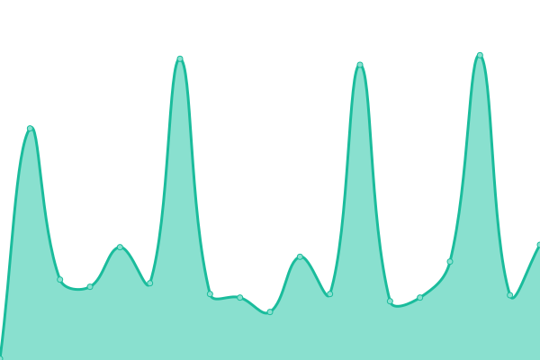
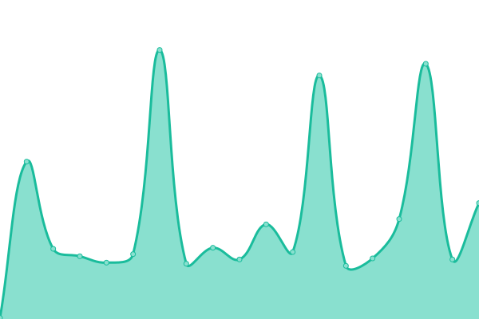
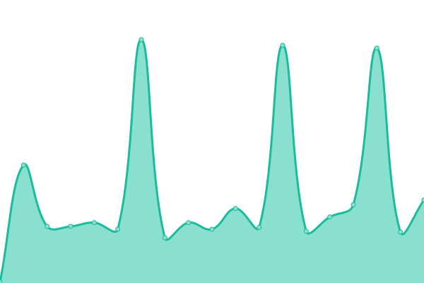
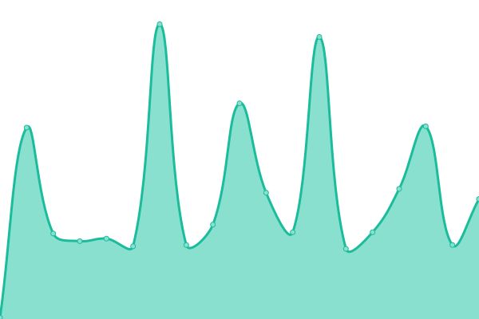
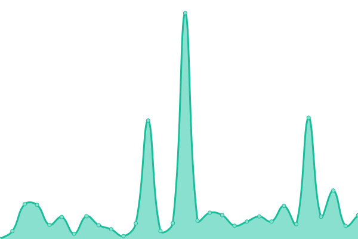

# [📈 Live Status](https://uptime.tannerln7.com): <!--live status--> **🟥 Complete outage**

This repository contains the open-source uptime monitor and status page for [Tanner Lane](https://uptime.tannerln7.com), powered by [Upptime](https://github.com/upptime/upptime).

With [Upptime](https://upptime.js.org), you can get your own unlimited and free uptime monitor and status page, powered entirely by a GitHub repository. We use [Issues](https://github.com/tannerln7/Upptime/issues) as incident reports, [Actions](https://github.com/tannerln7/Upptime/actions) as uptime monitors, and [Pages](https://uptime.tannerln7.com) for the status page.

<!--start: status pages-->
<!-- This summary is generated by Upptime (https://github.com/upptime/upptime) -->
<!-- Do not edit this manually, your changes will be overwritten -->
<!-- prettier-ignore -->
| URL | Status | History | Response Time | Uptime |
| --- | ------ | ------- | ------------- | ------ |
|  Plex | 🟥 Down | [plex.yml](https://github.com/tannerln7/Upptime/commits/HEAD/history/plex.yml) | 

 130ms
     
 | 

<a href="https://status.tannerln7.com/history/plex">1.81%</a>
    

|  Overseer | 🟥 Down | [overseer.yml](https://github.com/tannerln7/Upptime/commits/HEAD/history/overseer.yml) | 

 0ms
     
 | 

<a href="https://status.tannerln7.com/history/overseer">0.00%</a>
    

|  Episodes API | 🟥 Down | [episodes-api.yml](https://github.com/tannerln7/Upptime/commits/HEAD/history/episodes-api.yml) | 

 107ms
     
 | 

<a href="https://status.tannerln7.com/history/episodes-api">0.30%</a>
    

|  Movie API | 🟥 Down | [movie-api.yml](https://github.com/tannerln7/Upptime/commits/HEAD/history/movie-api.yml) | 

 93ms
     
 | 

<a href="https://status.tannerln7.com/history/movie-api">1.57%</a>
    

|  Download Client | 🟥 Down | [download-client.yml](https://github.com/tannerln7/Upptime/commits/HEAD/history/download-client.yml) | 

 109ms
     
 | 

<a href="https://status.tannerln7.com/history/download-client">0.58%</a>
    

|  Download Server | 🟥 Down | [download-server.yml](https://github.com/tannerln7/Upptime/commits/HEAD/history/download-server.yml) | 

 841ms
     
 | 

<a href="https://status.tannerln7.com/history/download-server">100.00%</a>
    

<!--end: status pages-->

[**Visit our status website →**](https://uptime.tannerln7.com)

## 📄 License

- Powered by: [Upptime](https://github.com/upptime/upptime)
- Code: [MIT](./LICENSE) © [Anand Chowdhary](https://anandchowdhary.com), supported by [Pabio](https://pabio.com)
- Data in the `./history` directory: [Open Database License](https://opendatacommons.org/licenses/odbl/1-0/)
